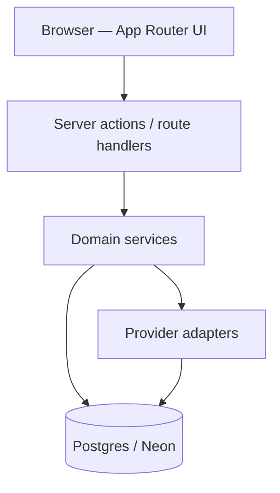

# Architecture

UPDON AI Marketing is a multi-tenant SaaS. Every customer record is scoped by `workspaceId`. Users join through `WorkspaceMember` (Owner / Admin / Marketer / Editor / Viewer). Social and integration tokens stay encrypted on the server.

## Layers

| Layer | Responsibility |
| --- | --- |
| UI | Marketing site, Auth.js session, dashboard. No API keys in the browser. |
| Actions | RBAC, workspace isolation, relative redirects. This boundary can become a standalone API later. |
| Domain | Social publish worker, SEO auditor, campaign planner, lead CRM, analytics, reports. |
| Adapters | AI, storage, ads, billing, keywords. Demo implementations run until credentials exist. |
| Data | Prisma 7. App uses pooled `DATABASE_URL`. CLI uses `DIRECT_URL` when set. |

## Adapters

| Capability | Module | Live when |
| --- | --- | --- |
| OpenAI / Anthropic / Gemini | `src/lib/ai/` | matching API key + `AI_PROVIDER` |
| Keyword research | `src/lib/seo/keyword-provider.ts` | Keyword Planner / DataForSEO (demo now) |
| Website crawler | `src/lib/seo/site-auditor.ts` | public http(s) URL |
| Meta / Google / LinkedIn ads | `src/lib/ads/networks.ts` | network credentials |
| Stripe / Razorpay | `src/lib/billing/gateway.ts` | gateway keys |
| Local / S3 / R2 storage | `src/lib/storage` | `STORAGE_DRIVER` |
| Social publish | `src/lib/social/` | OAuth apps + encrypted tokens |

## Git environments

`development` → `test` → `production`. Each git branch maps to a GitHub Environment and a Neon database. Secrets are never committed.

## Jobs

`POST /api/jobs/publish` and `npm run jobs:publish` publish due `SocialPost` rows. Instrumentation starts an in-process scheduler on Node only.
