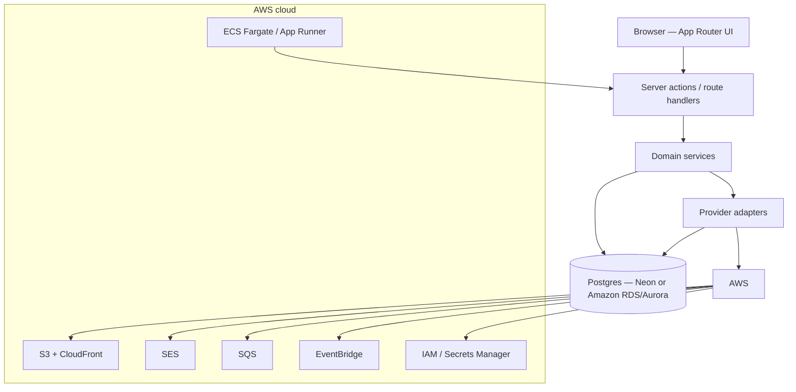

# Architecture

UPDON AI Marketing is a multi-tenant SaaS. Every customer record is scoped by `workspaceId`. Users join through `WorkspaceMember` (Owner / Admin / Marketer / Editor / Viewer). Social and integration tokens stay encrypted on the server. AWS credentials never render in the browser.

## Layers

| Layer | Responsibility |
| --- | --- |
| UI | Marketing site, Auth.js session, dashboard. No API keys in the browser. |
| Actions | RBAC, workspace isolation, relative redirects. This boundary can become a standalone API later. |
| Domain | Social publish worker, SEO auditor, campaign planner, lead CRM, analytics, reports. |
| Adapters | AI, AWS, storage, ads, billing, keywords. Demo implementations run until credentials exist. |
| Data | Prisma 7. App uses pooled `DATABASE_URL`. CLI uses `DIRECT_URL` when set. Neon is the default Postgres. Amazon RDS/Aurora is a drop-in via the same URL. |
| AWS | Object storage, email, job queue, scheduler, secrets, and optional container runtime. |

## AWS

Module: `src/lib/aws/`. Region defaults to `ap-south-1`. Set keys in GitHub Environment secrets (or an ECS task role in production).

| Service | Module | Env | Role |
| --- | --- | --- | --- |
| IAM | `src/lib/aws/config.ts` | `AWS_ACCESS_KEY_ID`, `AWS_SECRET_ACCESS_KEY`, `AWS_REGION` | Server-side credentials only |
| S3 | `src/lib/aws/s3.ts` | `AWS_S3_BUCKET`, `STORAGE_DRIVER=s3` | Brand assets and media |
| CloudFront | `src/lib/aws/config.ts` | `AWS_CLOUDFRONT_DOMAIN` | Public HTTPS URLs for S3 objects |
| SES | `src/lib/aws/ses.ts` | `AWS_SES_FROM`, `EMAIL_DRIVER=ses` | Password reset and transactional mail |
| SQS | `src/lib/aws/sqs.ts` | `AWS_SQS_PUBLISH_QUEUE_URL` | Queue for due-post publishing |
| EventBridge | `/api/jobs/publish` | `CRON_SECRET` | Schedule that POSTs the publish job |
| Secrets Manager | optional | `AWS_SECRETS_PREFIX` | Alternate secret store; GitHub Environments remain CI source of truth |
| ECS Fargate / App Runner | `Dockerfile` | `AWS_ECS_CLUSTER` or `AWS_APP_RUNNER_SERVICE` | Container runtime for Next.js |

Local development keeps `STORAGE_DRIVER=local` and the in-process scheduler. Turning on AWS does not require changing product features — only env.

## Other adapters

| Capability | Module | Live when |
| --- | --- | --- |
| OpenAI / Anthropic / Gemini | `src/lib/ai/` | matching API key + `AI_PROVIDER` |
| Keyword research | `src/lib/seo/keyword-provider.ts` | Keyword Planner / DataForSEO (demo now) |
| Website crawler | `src/lib/seo/site-auditor.ts` | public http(s) URL |
| Meta / Google / LinkedIn ads | `src/lib/ads/networks.ts` | network credentials |
| Stripe / Razorpay | `src/lib/billing/gateway.ts` | gateway keys |
| Social publish | `src/lib/social/` | OAuth apps + encrypted tokens |

## Git environments

`development` → `test` → `production`. Each git branch maps to a GitHub Environment and a database. AWS buckets/queues should be split the same way (`updon-dev`, `updon-test`, `updon-prod`). Secrets are never committed.

## Jobs

`POST /api/jobs/publish` and `npm run jobs:publish` publish due `SocialPost` rows. Instrumentation starts an in-process scheduler on Node only. Production can replace that with EventBridge → the same route, or SQS → a worker that calls `runPublishDuePosts`.
